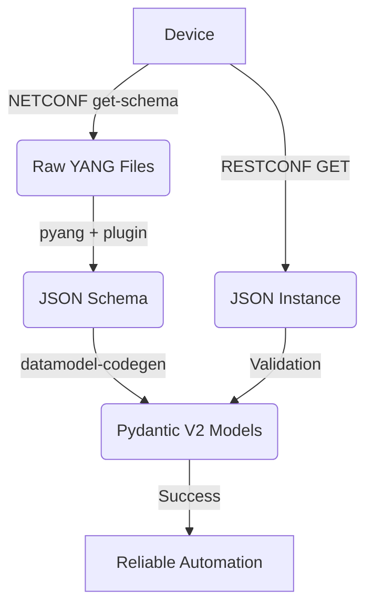

# ⚡ PyANGst: Pipeline to get Pydantic models from YANG without angst

This pipeline extracts the *actual* truth from your network devices and transforms it into type-safe, validated Pydantic V2 models.

> [!CAUTION]
> **Control Plane Warning:** This pipeline interacts with live hardware. Misuse of Step 3 can and will cause a CPU spike that can hang a production control plane. Read the warnings.

---

## 🏗️ The Pipeline Flow



---

## 🚀 Quick Start

You need [`uv`](https://github.com/astral-sh/uv) because `pip` is too slow and dependency resolution shouldn't be a hobby.

```bash
uv sync --locked
```

---

## 🛠️ Execution Steps

### 1. Model Extraction
Get the YANG models from the vendor or use the following to pull what the device is running.

```bash
uv run utils/yang_downloader.py '172.16.42.123' 'admin' 'pass' --port 830 --output-dir temp/yang_models/
```

### 2. Schema Transformation
YANG is for modeling; JSONSchema is for validating. We bridge this gap using `pyang` with the `jsonschema` plugin you find in the `utils/pyang_plugins/` directory (inspired by [pyang-json-schema-plugin](https://github.com/cmoberg/pyang-json-schema-plugin)).
You must know the .yang file containing the root of the YANG models.

```bash
uv run pyang -p temp/yang_models/ \
      --plugindir utils/pyang_plugins/ \
      -f jsonschema \
      --jsonschema-no-namespaces \
      --jsonschema-config-only \
      temp/yang_models/ROOT_MODEL_FILE > temp/schema.json
```

### 3. Data Acquisition
Fetch the actual configuration in JSON via RESTCONF. 

> [!WARNING]  
> **DO NOT REQUEST THE ROOT PATH (`restconf/data/`) ON PRODUCTION.**
> A large config can hit 100% CPU and trigger a watchdog reboot or OOM kill. Use lab equipment.

```bash
curl -k -u admin:pass -H "Accept: application/yang-data+json" \
     "https://172.16.42.123:8443/restconf/data?content=config" > temp/instance.json
```

### 4. Integrity Verification
Before generating code, verify the device's output matches its own schema. If this fails, the vendor's YANG implementation is buggy or the device is broken. 

```bash
uv run check-jsonschema --schemafile temp/schema.json temp/instance.json
```

### 5. Pydantic Model Generation
We target **Python 3.11+** using `datamodel-codegen`. Other configuration are available, see tool's documentation.

```bash
uv run datamodel-codegen \
    --input temp/schema.json \
    --input-file-type jsonschema \
    --output-model-type pydantic_v2.BaseModel \
    --output temp/models.py \
    --collapse-root-models \
    --use-default \
    --strict-nullable \
    --target-python-version 3.11 \
    --use-union-operator \
    --use-standard-collections
```

### 6. Final Validation
Load the device data into your new Python classes. If it loads, you have a type-safe interface to your network.

```bash
uv run utils/test_pydantic_models.py \
    --module 'temp.models' \
    --model 'Ne' \
    --json 'temp/instance.json'
```

Replace 'Ne' with the actual name of the root model.

---

## 📜 Dependencies

| Tool | Purpose | Reliability |
| :--- | :--- | :--- |
| `uv` | Package management | High (Rust-based) |
| `pyang` | YANG parsing | Industry Standard |
| `datamodel-codegen` | Pydantic generation | High |
| `check-jsonschema` | Fast validation | High |
